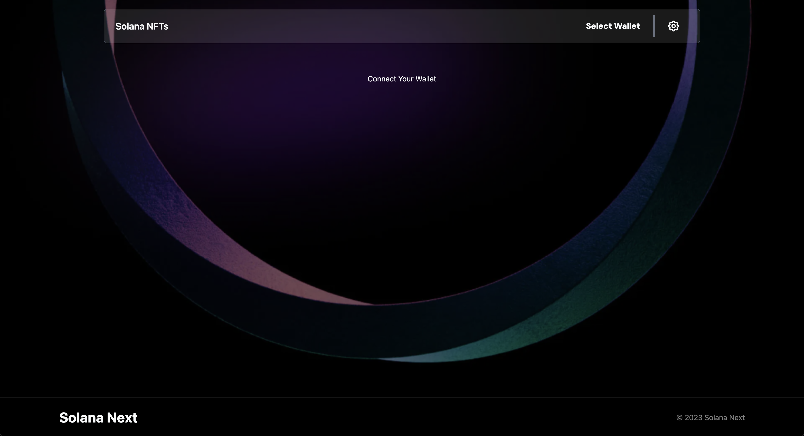
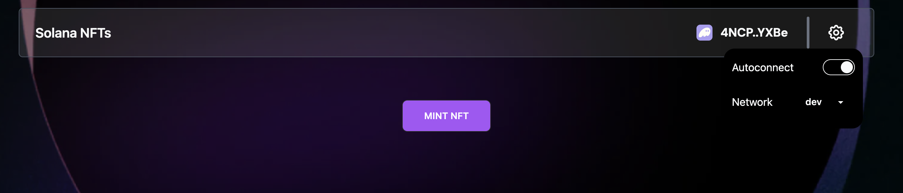
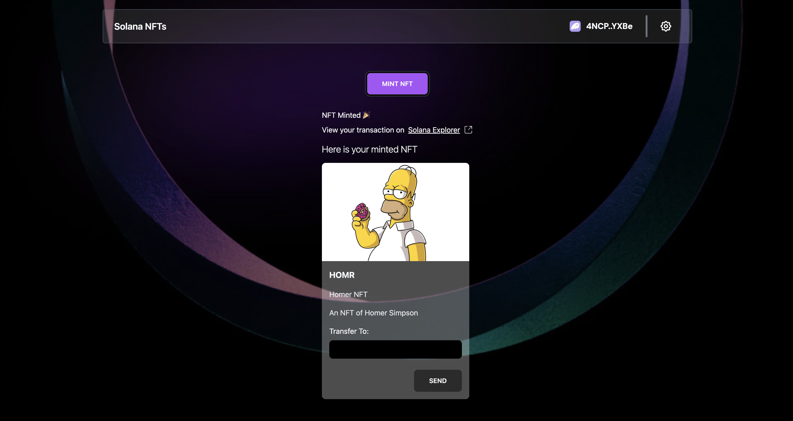
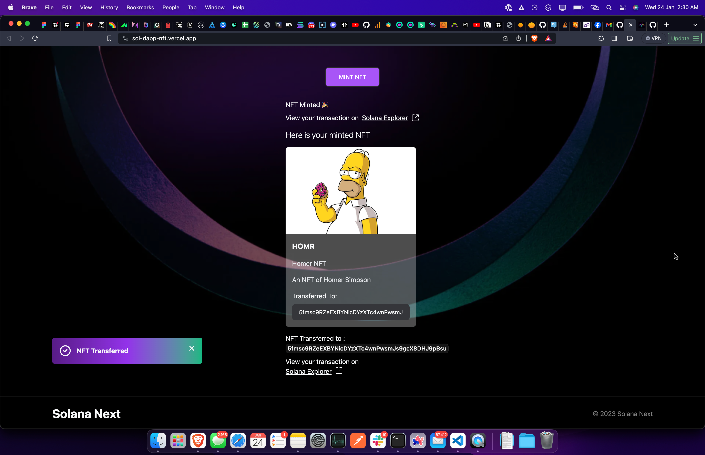

# Mint And Transfer NFT with Solang Solidity

## Introduction

This is a simple example of how to mint and transfer NFTs.

## Prerequisites

This is a react project, so you need to have nodejs installed. You can download it from [here](https://nodejs.org/en/download/).

## Installation

Clone the repository and install the dependencies:

```bash
git clone
cd spl-token-solana
npm install
```

## Usage

Start the project:

```bash
npm run dev
```

Open http://localhost:3000 with your browser to see the DApp.

## License

[MIT](https://choosealicense.com/licenses/mit/)

## Using the DAPP

1. Connect your wallet to the DAPP by clicking on the "Select Wallet" button.
   
   You can switch the network of the dapp from the header.
   

2. Now click on Mint NFT, once you sign the transaction a Token Account will be created for the NFT and NFT will be minted in your wallet.
   You can see the minted NFT and the NFT details on the screen
   

3. To transfer the NFT to another wallet, enter the wallet address in the input box, click SEND, and after signing the transaction your NFT will be transferred to another wallet.
   

## Creating the similar DApp

1. To create the similar Dapp you need to have pre knowledge of react and basic of spl token and solana NFTs.
2. You can use the code from the repository and modify it according to your need.
3. You can also use the code from the repository and deploy it on vercel or netlify to create your own DApp.

## Code Explanation

To mint a new NFT first you have to create a mint for that nft and then get the token account for the NFT and then mint the NFT in that account.

```javascript
await program.methods
    .createTokenMint(
        dataAccountPDA,
        0, // 0 decimals for NFT
        nftTitle, // NFT name
        nftSymbol, // NFT symbol
        nftUri // NFT URI
    )
    .accounts({
        payer: wallet.publicKey,
        mint: mintKeypair.publicKey,
        metadata: metadataAddress,
        mintAuthority: dataAccountPDA,
        rentAddress: SYSVAR_RENT_PUBKEY,
        metaplexId: new PublicKey("metaqbxxUerdq28cj1RbAWkYQm3ybzjb6a8bt518x1s"),
    })
    .signers([mintKeypair])
    .rpc({ skipPreflight: true });
```

```javascript
await program.methods
    .mintTo()
    .accounts({
        pdaAccount: dataAccountPDA,
        payer: wallet.publicKey,
        tokenAccount: tokenAccount,
        owner: wallet.publicKey,
        mint: mintKeypair.publicKey,
    })
    .rpc({ skipPreflight: true });
```

To get the NFT metadata you can use the methods by Metaplex.

```javascript
const metadata = await metaplex.nfts().findByMint({ mintAddress: mintKeypair.publicKey, tokenOwner: wallet.publicKey });
```

To transfer the NFT you have to get the seller token account and get or create a new token account for the receiver and then transfer the NFT to that account.

```javascript
const sellerTokenAccount = await getAssociatedTokenAddress(
    mint.publicKey,
    publicKey,
    false,
    TOKEN_PROGRAM_ID,
    ASSOCIATED_TOKEN_PROGRAM_ID
);

const buyerTokenAccount = await getAssociatedTokenAddress(
    mint.publicKey,
    buyerPublicKey,
    false,
    TOKEN_PROGRAM_ID,
    ASSOCIATED_TOKEN_PROGRAM_ID
);

createAssociatedTokenAccountInstruction(
    publicKey,
    buyerTokenAccount,
    buyerPublicKey,
    mint.publicKey,
    TOKEN_PROGRAM_ID,
    ASSOCIATED_TOKEN_PROGRAM_ID
);
```

```javascript
await program.methods
    .transferNft()
    .accounts({
        owner: wallet.publicKey,
        from: sellerTokenAccount,
        to: buyerTokenAccount,
    })
    .rpc({ skipPreflight: true });
```

BOOM! You have successfully minted and transferred the NFT.
